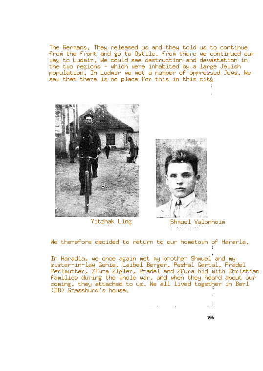

# yizk
Download, OCR, translate and render [yizkor books](https://en.wikipedia.org/wiki/Yizkor_books)

This tool helps in the translation of yizkor books that are usually in yidish and hebrew. 

It OCR and translate the texts and then tries to rebuild the page (including the images) with the translated text. 

It uses the gooogle cloud vision and translation API 

## Transaltion examples

Original        |  Translated
:-------------------------:|:-------------------------:
 |  


## Compile 

Compile the code 

```
go build
```

## Use

Yizk is a cli tool, you have commands for each step of the processing pipeline. 
For OCR and translation you need a google cloud account and a credential file
named `creds.json` on the root dir. 

Make sure you have enabled the vision and translation API.

### Book downloading 

I use the new your public library site to download the books, but its possible to use any other source. 
Here is the catalog:  https://libguides.nypl.org/yizkorbooks

### Process

Once you have the download files/pages into a folder just run the `all` command.
This will ocr, translate and render a page. 

```
./yizk all -m ./tmp/horodlo/56990656.json
```

Is it possible also to run any step of the proces like this:

OCR:
```
./yizk ocr -m ./tmp/horodlo/56990656.json
```

Translate:
```
./yizk translate -m ./tmp/horodlo/56990656.json
```

Render:
```
./yizk render -m ./tmp/horodlo/56990656.json
```

You can also run the process for all files in the folder with `-f` 


Render:
```
./yizk render -f ./tmp/horodlo/
```


